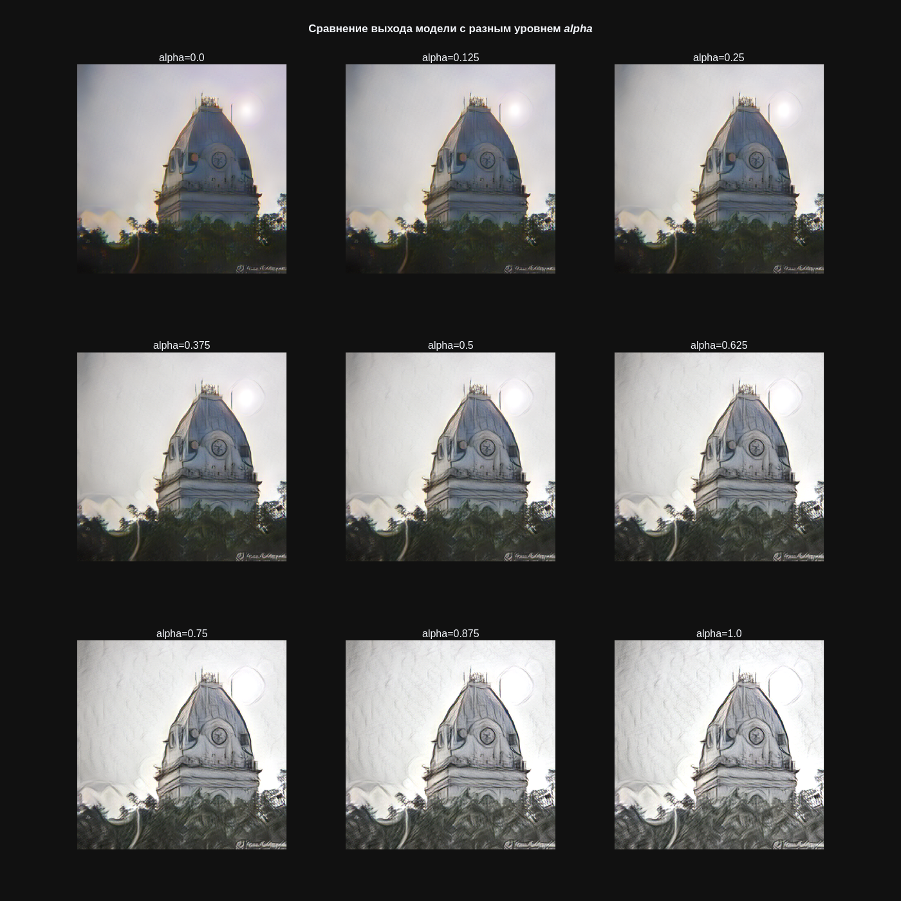

# <center>Style transfer using Adaptive Instance Normalization
AdaIN implementation on *Tensorflow / Keras*

Dataset, used as **content** — `2015 Test images [81K/12GB]` from https://cocodataset.org/#download

Dataset, used as **style** — `train.zip` from https://www.kaggle.com/c/painter-by-numbers/data

[<b>Link to trained <i>Keras</i> model</b>](https://drive.google.com/file/d/1N0t6uhtO4W9tlLvTGLqm_y5beZQmu7sk/view?usp=drive_link)
## Notebooks
* [<b>StyleTransferModel.ipynb</b>](StyleTransferModel.ipynb) — preparing the dataset and training the model

* [<b>InferenceTest.ipynb</b>](InferenceTest.ipynb) — testing a trained model(-s) with visualization of the results

* [<b>TFLite.ipynb</b>](TFLite.ipynb) — example of conversion and inference of a model in `.tflite` format for mobile devices

## Model
Folder [<b>net</b>](net) contains 2 files:
* `net_modules.py` — key layers (`keras.layers.Layer`) of the neural network: 
    * **Encoder** — rebuilt first 4 blocks of pretrained *VGG-19* (`block1_conv1`, `block2_conv1`, `block3_conv1`, `block4_conv1`) with added `ReflectionPadding2D` before every `Conv2D`
    * **Decoder** — mirrored encoder
    * **ReflectionPadding2D** — reflection pad `(1, 1, 1, 1)`
    * **AdaIN** — $\text{AdaIN}(x, y) = \sigma(y)\Big( \frac{x-\mu(x)}{\sigma(x)} \Big) + \mu(y)$

* `style_autoencoder.py` — the model itself (`keras.Model`) with preprocessing and postprocessing of input and output data, respectively

## Examples of style transfer
### Default config

### The effect of the alpha threshold on the result

## Streamlit web application
[<b>streamlit_app</b>](streamlit_app) contains the source code for demonstrating the model inference  in the form of a website

[<b>Link to site</b>](https://image-style-transfer-adain.streamlit.app/)

Usage example:  

## An example of obtaining a stylized image using a pre-trained model
1. The [<b>net</b>](net) module must be placed in the current folder `.`, otherwise you need to change the function argument to the path to the net module `sys.path.append('NET_MODULE_PATH')`

2. Minimum necessary imports
    ```py
    import os
    import sys
    sys.path.append('.')
    os.environ['TF_CPP_MIN_LOG_LEVEL'] = '3'
    import tensorflow as tf
    import keras
    import wget
    ```
3. Load model
    ```py
    folder_name='model/'
    model_filename = folder_name + 'model.keras'
    # Download model if not already downloaded
    if not os.path.exists(folder_name): 
        os.mkdir(folder_name)
        url_model = r'https://drive.usercontent.google.com/download?id=1N0t6uhtO4W9tlLvTGLqm_y5beZQmu7sk&export=download&confirm=yes'
        wget.download(url_model, out=model_filename)
    # Load pretrained model
    model = keras.models.load_model(model_filename, compile=False)
    model.trainable = False
    ```

4. Initialize content and style images:
    ```py
    content_path = r'YOUR_PATH_TO_CONTENT_IMAGE'
    style_path = r'YOUR_PATH_TO_CONTENT_IMAGE'
    # Bytes -> Tensor with shape [B, H, W, C]
    content_img = tf.image.decode_image(tf.io.read_file(content_path), channels=3)[tf.newaxis, ...]
    style_img = tf.image.decode_image(tf.io.read_file(style_path), channels=3)[tf.newaxis, ...]
    ```

5. Call `predict` method:
    ```py
    # Style weight
    alpha = 1
    # Match style histogram using content histogram
    save_content_colors = False
    # Stylized RGB image with shape [B, H, W, C] and uint8 type 
    outputs = model.predict(content_img, style_img, alpha, save_content_colors)
    ```
    
## References
*Arbitrary Style Transfer in Real-time with Adaptive Instance Normalization* - https://arxiv.org/abs/1703.06868